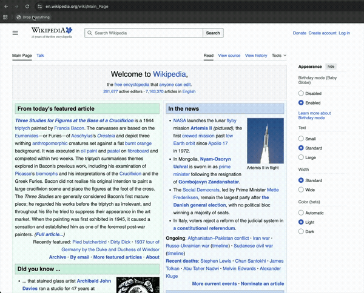

# Drop Everything

A bookmarklet that turns any webpage into a physics playground. Words fall off the page as solid bodies, powered by two APIs.



## APIs Used

### HTML-in-Canvas (`drawElementImage`)

An experimental Chrome API that renders live DOM elements directly into a `<canvas>` context.

- **Spec**: [WICG/html-in-canvas](https://github.com/WICG/html-in-canvas)
- **Status**: Behind a flag in Chromium (`chrome://flags/#canvas-draw-element`)
- **Key method**: `ctx.drawElementImage(element, dx, dy)` — draws a snapshot of an element into the canvas
- **Requirement**: The element must be a **direct child** of a `<canvas>` with the `layoutsubtree` attribute. Children of that element can be nested normally.
- **How we use it**: Each word span and image is wrapped in a `<div>` that is a direct canvas child. The physics engine provides position/rotation, and `drawElementImage` renders the styled DOM element at that transform.

### Matter.js

A 2D rigid body physics engine.

- **Docs**: [brm.io/matter-js](https://brm.io/matter-js/)
- **Loaded from CDN** at runtime (works as bookmarklet on any page)
- **How we use it**: Each word/image becomes a `Bodies.rectangle` with friction, restitution, and density. Static walls (floor, left, right) contain the bodies. Window movement shifts the gravity vector to create inertia effects.

## How It Works

1. Walk the DOM, wrap every visible text node into individual `<span>` elements per word
2. Bake computed styles (color, font, etc.) onto each span so they survive reparenting
3. Create a fullscreen `<canvas layoutsubtree>` overlay
4. Clone each word/image into a wrapper `<div>` as a direct canvas child
5. Draw the static frame with `drawElementImage`, then hide the originals (transparent text, placeholder images)
6. Activate Matter.js bodies bottom-first with a stagger — words start falling
7. Each frame: update physics, clear canvas, draw each body at its Matter.js position/rotation
8. Window `screenX`/`screenY` changes shift the gravity vector, creating inertia when dragging the browser window

## Setup

```
npm install
npm run dev
```

Open `localhost:5173`, drag the **Drop Everything** bookmarklet to your bookmarks bar, then use it on any page.

**Requires**: Chrome Canary with `chrome://flags/#canvas-draw-element` enabled.

## Known Limitations

- **Visual jump on activation**: `drawElementImage` requires elements to have a cached paint record, which only exists after a full frame. This means canvas children must be in the DOM for one frame before they can be drawn — causing a brief flash where the `layoutsubtree` wrappers are visible as raw HTML before the first canvas draw replaces the originals.
- **Lower resolution on Retina displays**: `drawElementImage` renders at the canvas backing store resolution. Setting the backing store to `width * devicePixelRatio` breaks `layoutsubtree` child layout (children seem to lay out based on the canvas pixel dimensions, not its CSS size). As a result, on 2x displays the text appears slightly blurrier than the native page rendering.
- **Cross-origin images excluded**: Only same-origin images are collected as physics bodies. Cross-origin images would taint the canvas, similar to `drawImage` restrictions.
